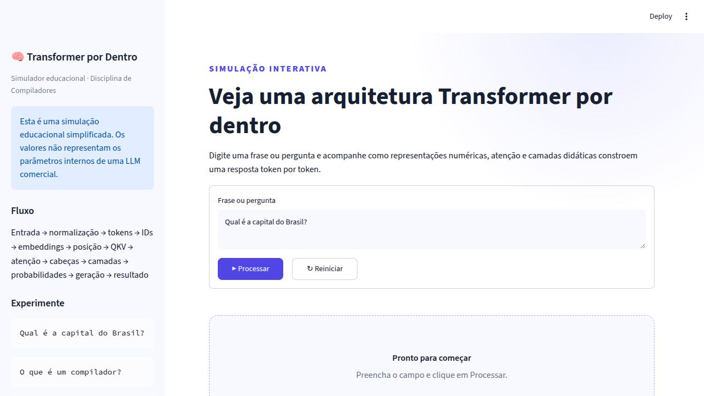
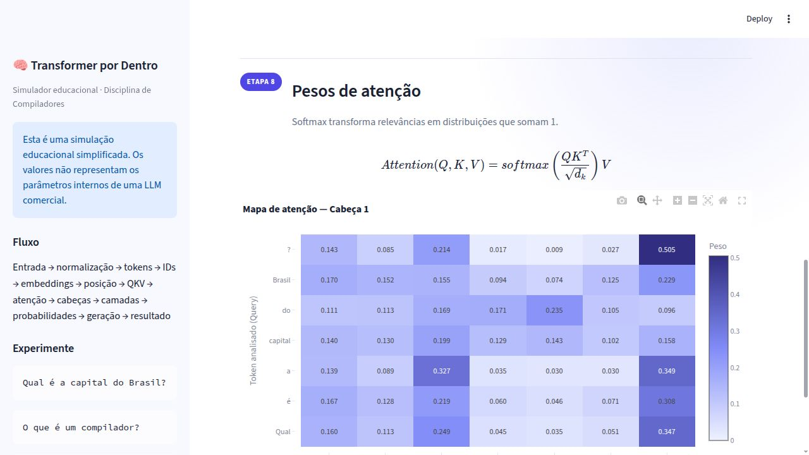

# Transformer por Dentro

Simulador educacional de uma arquitetura Transformer desenvolvido em Python
para a disciplina de Compiladores. A aplicação recebe uma frase ou pergunta e
mostra, passo a passo, como representações numéricas, atenção e camadas
simplificadas podem produzir uma resposta token por token.

> **Aviso:** esta é uma simulação educacional simplificada. Os valores não
> representam os parâmetros internos de uma LLM comercial.



## Objetivo

Demonstrar visualmente o fluxo principal de uma arquitetura Transformer sem
treinar ou consultar uma LLM comercial. A solução prioriza transparência:
tokens, IDs, vetores, matrizes, pesos, probabilidades e limitações podem ser
inspecionados na interface.

## Tecnologias utilizadas

| Tecnologia | Finalidade | Entrada | Saída |
|---|---|---|---|
| Python 3.10+ | linguagem principal | texto e configurações | pipeline completo |
| Streamlit | interface web | resultado da simulação | painéis interativos |
| NumPy | operações matemáticas | vetores e matrizes | QKV, atenção e camadas |
| Plotly | visualização | pesos e probabilidades | mapa de calor e gráfico |
| Pytest | testes automatizados | casos e valores esperados | relatório de aprovação |

Nenhuma API externa ou chave secreta é necessária.

## Como instalar e executar

No terminal, entre nesta pasta e crie um ambiente virtual:

```bash
cd transformer-simulator
python3 -m venv .venv
source .venv/bin/activate
pip install -r requirements.txt
streamlit run app.py
```

Abra `http://localhost:8501` caso o navegador não seja aberto
automaticamente.

Para instalar também as ferramentas de teste:

```bash
pip install -r requirements-dev.txt
pytest
```

O comando esperado termina com `31 passed`.

## Como usar

1. Digite uma frase ou pergunta.
2. Clique em **Processar**.
3. Navegue pelas abas numeradas de 1 a 13.
4. Na aba de geração, use **Próximo** para acompanhar a resposta token por
   token.
5. Consulte o resumo final ou baixe o resultado completo em JSON.
6. Use **Reiniciar** para começar novamente.

Perguntas cadastradas para demonstração:

```text
Qual é a capital do Brasil?
O que é um compilador?
Quanto é 2 + 2?
```

## Etapas implementadas

1. Recebimento da frase original.
2. Normalização Unicode e de espaços.
3. Tokenização e contagem.
4. Conversão em IDs.
5. Embeddings didáticos.
6. Codificação posicional senoidal.
7. Query, Key e Value.
8. Atenção escalada e softmax.
9. Duas cabeças de atenção.
10. Três camadas sequenciais.
11. Probabilidades do próximo token.
12. Geração progressiva com reprocessamento do contexto.
13. Resumo e resposta final.

## Como funciona a tokenização

O tokenizador usa uma expressão regular Unicode. Palavras, números e sinais de
pontuação são separados; por isso `Brasil?` produz os tokens `Brasil` e `?`.
Um token não precisa corresponder a uma palavra. Tokens ausentes do vocabulário
continuam visíveis, mas recebem o ID `1`, reservado para `<UNK>`.

## Como os embeddings são gerados

Cada ID é convertido em um vetor determinístico de quatro dimensões:

```text
E(id) = [
  sin(0,13 × id),
  cos(0,07 × id),
  sin(0,017 × id + 0,5),
  cos(0,031 × id - 0,25)
]
```

Esses valores são artificiais, reproduzíveis e exibidos como **Embedding
didático simulado**. Eles não representam o significado real das palavras.

## Como a posição é incluída

O projeto usa uma codificação senoidal de quatro dimensões inspirada na fórmula
original dos Transformers. O vetor de posição é somado ao embedding antes da
atenção. Assim, tokens iguais em posições diferentes deixam de ter a mesma
representação.

## Como Query, Key e Value são obtidos

Cada cabeça possui matrizes fixas e visíveis `WQ`, `WK` e `WV`. Para a matriz de
entrada posicionada `X`, o NumPy calcula:

```text
Q = X × WQ
K = X × WK
V = X × WV
```

As matrizes são pequenas, foram escolhidas para a simulação e não foram
aprendidas por treinamento.

## Como os pesos de atenção são calculados

O simulador executa a equação de atenção escalada:

```text
Attention(Q, K, V) = softmax(QKᵀ / √dk)V
```

O softmax é implementado de forma numericamente estável. Cada linha de pesos é
não negativa e soma aproximadamente `1`. A interface mostra os valores em uma
tabela e em um mapa de calor.



## Como as cabeças e camadas são simuladas

Duas cabeças usam matrizes diferentes. Seus rótulos “local/sintática” e
“global/contextual” são interpretações didáticas; cabeças de modelos reais não
possuem necessariamente funções fixas.

Depois da concatenação das cabeças, três camadas recebem sequencialmente a saída
anterior:

1. **Relações locais:** combina cada token com os vizinhos.
2. **Relações contextuais:** usa similaridade para combinar tokens distantes.
3. **Preparação da resposta:** projeta os vetores e aplica `tanh`.

## Como o próximo token é escolhido

Uma pequena base cadastrada fornece a resposta-alvo e candidatos didáticos. Em
cada iteração, as probabilidades somam `1` e a estratégia `argmax` seleciona o
candidato de maior probabilidade. O contexto com os tokens já gerados é
processado novamente antes da próxima seleção.

Perguntas desconhecidas recebem a resposta explícita: “Não tenho uma resposta
cadastrada para essa pergunta.”

## Partes reais e simuladas

**Operações reais:** normalização, tokenização, IDs, codificação senoidal,
multiplicações matriciais, QKV, produto escalar escalado, softmax,
reprocessamento do contexto e argmax.

**Partes simuladas:** vocabulário reduzido, embeddings artificiais, matrizes
fixas, significado atribuído às cabeças, simplificação das camadas, candidatos,
probabilidades e respostas cadastradas.

## Limitações

- Não existe treinamento nem aprendizado durante a execução.
- O vocabulário e a base de respostas são pequenos.
- Palavras desconhecidas compartilham o mesmo ID e embedding `<UNK>`.
- Os embeddings não codificam semântica real.
- As probabilidades não são previsões de um modelo treinado.
- As camadas omitem componentes reais como normalização, resíduos e redes
  feed-forward completas.
- A implementação não reproduz os parâmetros de uma LLM comercial.

## Testes

Foram implementados 31 testes automatizados. Os dez cenários exigidos no
enunciado estão registrados em:

- [Tabela em Markdown](./evidencias/resultados-dos-testes/testes-obrigatorios.md)
- [Tabela em CSV](./evidencias/resultados-dos-testes/testes-obrigatorios.csv)

Para recriar a tabela:

```bash
python scripts/generate_test_report.py
```

## Arquitetura e documentação

- [Diagrama e arquitetura](./docs/arquitetura.md)
- [Análise do enunciado](./docs/analise-do-enunciado.md)
- [Relatório técnico](./RELATORIO.md)
- [Roteiro de apresentação](./docs/roteiro-apresentacao.md)
- [Registro de prompts](./PROMPTS.md)
- [Capturas de tela](./evidencias/capturas-de-tela/README.md)
- [Vídeo de demonstração](./evidencias/video/demonstracao-transformer.mp4)

## Estrutura

```text
transformer-simulator/
├── app.py                         # interface Streamlit
├── src/transformer_simulator/     # núcleo independente da interface
│   ├── normalization.py
│   ├── tokenization.py
│   ├── vocabulary.py
│   ├── embeddings.py
│   ├── attention.py
│   ├── layers.py
│   ├── generation.py
│   └── simulator.py
├── tests/                         # unitários, integração e casos obrigatórios
├── scripts/                       # geração de tabela e vídeo
├── docs/                          # análise, arquitetura e apresentação
└── evidencias/                    # tabelas, capturas e vídeo
```

## Entregáveis

- [x] Código-fonte completo.
- [x] Instruções para execução.
- [x] README.
- [x] Diagrama da arquitetura.
- [x] Relatório de cada etapa.
- [x] Tabela dos testes.
- [x] Capturas de tela.
- [x] Vídeo curto.
- [x] Registro dos principais prompts.
