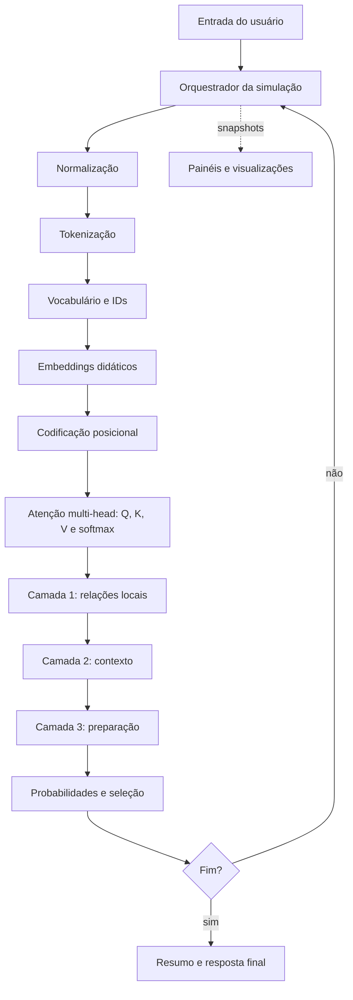

# Arquitetura planejada

## Visão geral

A solução será uma aplicação web de página única. O navegador executará tanto a
interface quanto o simulador, sem servidor e sem API externa. Essa escolha torna
cada valor reproduzível durante a apresentação e facilita a publicação estática.



## Princípios

1. **Determinismo:** a mesma entrada deve produzir os mesmos vetores e a mesma
   explicação, possibilitando testes e apresentação confiáveis.
2. **Transparência:** matrizes, fórmulas, resultados intermediários e avisos de
   simulação ficam visíveis.
3. **Separação:** o núcleo não depende de React; componentes apenas apresentam
   snapshots calculados pelo domínio.
4. **Encadeamento real:** cada etapa recebe a saída tipada da anterior.
5. **Acessibilidade:** cores terão rótulos numéricos e não serão o único meio de
   comunicar intensidade.

## Responsabilidade dos módulos

| Caminho | Responsabilidade |
|---|---|
| `src/app` | ciclo Processar/Reiniciar, passo atual e histórico da geração |
| `src/core/normalization` | espaços, caixa, pontuação e caracteres especiais |
| `src/core/tokenization` | tokens e posições originais |
| `src/core/vocabulary` | IDs estáveis, vocabulário e token desconhecido |
| `src/core/embeddings` | vetores didáticos e metadados de origem |
| `src/core/positional-encoding` | codificação senoidal ou regra justificada |
| `src/core/attention` | matrizes QKV, atenção escalada, softmax e duas cabeças |
| `src/core/layers` | três transformações sequenciais e suas explicações |
| `src/core/generation` | candidatos, probabilidades, `argmax` e parada |
| `src/components` | controles, navegação e visualizações educacionais |
| `src/data` | vocabulário, matrizes e respostas cadastradas |
| `src/types` | contratos compartilhados entre núcleo e interface |
| `tests` | provas numéricas, pipeline e dez situações do enunciado |
| `evidencias` | resultados, capturas e vídeo exigidos para entrega |

## Contrato de dados central

O orquestrador produzirá um `SimulationSnapshot` imutável para cada passo. O
contrato deverá conter, no mínimo:

```ts
interface SimulationSnapshot {
  originalInput: string;
  normalizedInput: string;
  inputTokens: TokenInfo[];
  embeddings: VectorInfo[];
  positionalVectors: VectorInfo[];
  attentionHeads: AttentionHeadResult[];
  layers: LayerResult[];
  generationSteps: GenerationStep[];
  finalAnswer: string;
  disclosures: { real: string[]; simulated: string[] };
}
```

Esse modelo evita que a interface invente dados para preencher painéis. Toda
visualização deriva do mesmo snapshot usado nos testes.

## Núcleo matemático

- Embeddings terão dimensão pequena e origem determinística documentada.
- Posição será incorporada antes de QKV.
- Cada cabeça possuirá matrizes fixas `WQ`, `WK` e `WV`.
- Os escores serão calculados por `QK^T / sqrt(dk)`.
- `softmax` produzirá pesos não negativos, com soma próxima de 1 por linha.
- As duas cabeças serão combinadas antes das três camadas.
- Toda aproximação será rotulada como didática.

Os nomes educacionais das cabeças descreverão o que a configuração busca
destacar, sem afirmar que cabeças reais têm funções fixas.

## Estado e geração progressiva

Ao selecionar um candidato, o token será anexado ao contexto. O orquestrador
criará um novo passo de geração, preservando os anteriores para animação e
auditoria. A execução termina ao encontrar um token final, atingir o limite
seguro de tokens ou usar o fallback para pergunta desconhecida.

## Estratégia de testes

- **Unitários:** normalização, tokenização, IDs, dimensões, multiplicação de
  matrizes, estabilidade de softmax, soma da atenção e seleção por `argmax`.
- **Integração:** compatibilidade entre as saídas das 13 etapas, três camadas
  encadeadas e término da geração.
- **Ponta a ponta:** os dez casos obrigatórios, incluindo erro para vazio,
  palavra desconhecida, ordem diferente e caracteres especiais.
- **Evidência:** uma tabela versionada registrará esperado, obtido, resposta e
  aprovação de cada caso.

## Fases de implementação

1. Contratos, dados determinísticos e núcleo matemático.
2. Orquestrador e snapshots da geração.
3. Interface por painéis, tabelas, mapa de calor e animação progressiva.
4. Testes, acessibilidade e tratamento de limites.
5. Relatório, capturas, vídeo e publicação.

Recursos adicionais do enunciado somente entram depois da validação dessa base.
