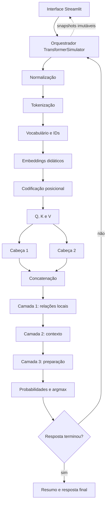

# Arquitetura do projeto

## Explicação curta para a apresentação

A arquitetura separa a interface da lógica matemática. O Streamlit recebe a
pergunta e apresenta os resultados; o pacote `transformer_simulator` executa as
transformações sem depender da interface. Cada etapa recebe a saída da etapa
anterior, e o contexto é processado novamente após cada token gerado.

## Diagrama

O código-fonte do diagrama também está disponível em
[`diagrama-arquitetura.mmd`](./diagrama-arquitetura.mmd).

## Camadas de software

| Camada | Arquivos | Responsabilidade |
|---|---|---|
| Apresentação | `app.py`, `styles.css` | entrada, botões, abas, tabelas e gráficos |
| Orquestração | `simulator.py` | executar etapas e construir o resultado completo |
| Domínio | `normalization.py` até `generation.py` | cálculos independentes do Streamlit |
| Contratos | `models.py` | dataclasses imutáveis compartilhadas |
| Dados didáticos | `vocabulary.py`, `required_cases.py` | IDs e cenários auditáveis |
| Qualidade | `tests/`, `scripts/` | testes e geração das evidências |

## Fluxo dos dados

`SimulationResult` é o contrato central. Ele reúne entrada original e
normalizada, tokens, vetores, duas cabeças, três camadas, passos de geração,
resposta final e a separação entre operações reais e simuladas. A interface
somente exibe esse resultado; ela não cria valores matemáticos.

Durante a geração, cada `GenerationStep` armazena contexto, candidatos,
probabilidades, token escolhido, texto parcial e resumo do vetor contextual.
Isso permite avançar e voltar pela geração sem recalcular valores na interface.

## Decisões importantes

1. **Execução local:** não existe backend remoto nem API de LLM.
2. **Determinismo:** a mesma entrada produz o mesmo resultado.
3. **Transparência:** fórmulas, matrizes e somas são mostradas.
4. **Testabilidade:** o núcleo não importa Streamlit.
5. **Honestidade:** toda aproximação é rotulada como simulada.
6. **Acessibilidade:** valores numéricos acompanham as cores do mapa.

## Dependências

- Streamlit recebe os objetos do núcleo e renderiza os painéis.
- NumPy recebe matrizes numéricas e devolve projeções, pesos e vetores.
- Plotly recebe pesos/probabilidades e devolve visualizações interativas.
- Pytest recebe entradas e expectativas e devolve aprovação ou falha.

Nenhuma dessas bibliotecas fornece uma resposta de LLM ou revela pesos de um
modelo comercial.
